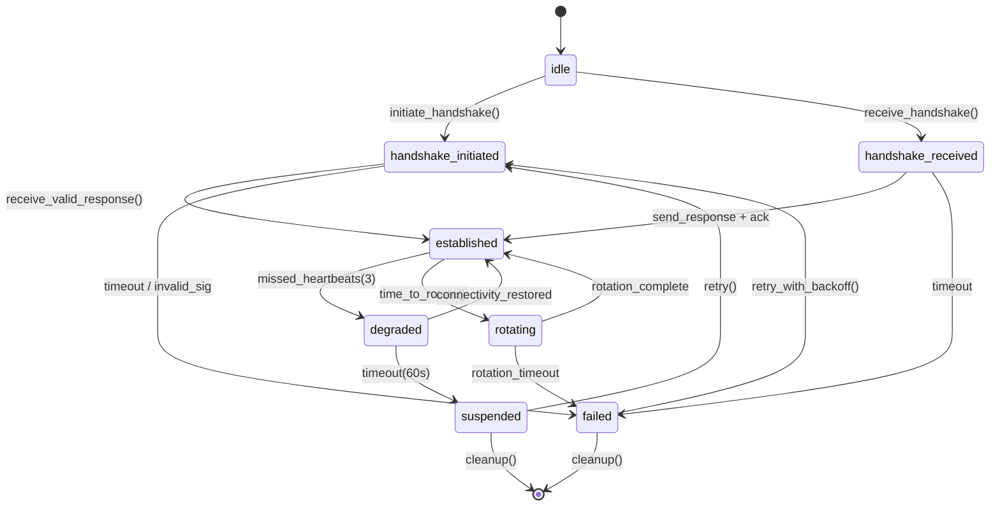

# SPEC-018: L2 Session Manager

**Status:** DRAFT  
**Version:** 0.1.0  
**Date:** 2026-02-02  
**Profile:** :service (with :core crypto primitives)  
**Supersedes:** None (New Feature)

---

## 1. Overview

The L2 Session Manager provides sovereign, cryptographically verified peer-to-peer session management for the Libertaria Stack. It establishes trust relationships, maintains them through network disruptions, and ensures post-quantum security through automatic key rotation.

### 1.1 Design Principles

1. **Explicit State**: Every session state is explicit, logged, and auditable
2. **Graceful Degradation**: Sessions survive network partitions without data loss
3. **No WebSockets**: Uses QUIC/μTCP only (see ADR-001)
4. **Post-Quantum Security**: X25519Kyber768 hybrid key exchange

### 1.2 Transport Architecture

| Transport | Role | Protocol Details |
|-----------|------|------------------|
| QUIC | Primary | UDP-based, 0-RTT, TLS 1.3 built-in |
| μTCP | Fallback | Micro-optimized TCP, minimal overhead |
| Raw UDP | Discovery | Stateless probing, STUN-like |

**Rationale**: WebSockets (RFC 6455) are excluded. They add HTTP handshake overhead, require proxy support, and don't support UDP hole punching natively.

---

## 2. Behavioral Specification (BDD)

### 2.1 Session Establishment

```gherkin
Feature: Session Establishment

  Scenario: Successful establishment with new peer
    Given a discovered peer with valid DID
    When session establishment is initiated
    Then state transitions to "handshake_initiated"
    And PQxdh handshake request is sent
    When valid handshake response received
    Then state transitions to "established"
    And shared session keys are derived
    And TTL is set to 24 hours

  Scenario: Session resumption
    Given previous session exists with unchanged prekeys
    When resumption is initiated
    Then existing key material is reused
    And state becomes "established" within 100ms

  Scenario: Establishment timeout
    When no response within 5 seconds
    Then state transitions to "failed"
    And failure reason is "timeout"
    And retry is scheduled with exponential backoff

  Scenario: Authentication failure
    When invalid signature received
    Then state transitions to "failed"
    And failure reason is "authentication_failed"
    And peer is quarantined for 60 seconds
```

### 2.2 Session Maintenance

```gherkin
Feature: Session Maintenance

  Scenario: Heartbeat success
    When 30 seconds pass without activity
    Then heartbeat is sent
    And peer responds within 2 seconds
    And TTL is extended

  Scenario: Single missed heartbeat
    Given peer misses 1 heartbeat
    When next heartbeat succeeds
    Then session remains "established"
    And warning is logged

  Scenario: Session suspension
    Given peer misses 3 heartbeats
    When third timeout occurs
    Then state becomes "suspended"
    And queued messages are held
    And recovery is attempted after 60s

  Scenario: Automatic key rotation
    Given session age reaches 24 hours
    When rotation window triggers
    Then new ephemeral keys are generated
    And re-handshake is initiated
    And no messages are lost
```

### 2.3 Degradation and Recovery

```gherkin
Feature: Degradation and Recovery

  Scenario: Network partition detection
    When connectivity lost for >30s
    Then state becomes "degraded"
    And messages are queued
    And session is preserved

  Scenario: Partition recovery
    Given session is "degraded"
    When connectivity restored
    Then re-establishment is attempted
    And queued messages are flushed

  Scenario: Transport fallback
    Given session over QUIC
    When QUIC fails
    Then re-establishment over μTCP is attempted
    And this is transparent to upper layers
```

---

## 3. State Machine

### 3.1 State Definitions

| State | Description | Valid Transitions |
|-------|-------------|-------------------|
| `idle` | Initial state | `handshake_initiated`, `handshake_received` |
| `handshake_initiated` | Awaiting response | `established`, `failed` |
| `handshake_received` | Received request, preparing response | `established`, `failed` |
| `established` | Active session | `degraded`, `rotating` |
| `degraded` | Connectivity issues | `established`, `suspended` |
| `rotating` | Key rotation in progress | `established`, `failed` |
| `suspended` | Extended failure | `[cleanup]`, `handshake_initiated` |
| `failed` | Terminal failure | `[cleanup]`, `handshake_initiated` (retry) |

### 3.2 State Diagram



---

## 4. Architecture Decision Records

### ADR-001: No WebSockets

**Context:** P2P systems need reliable, low-latency, firewall-traversing transport.

**Decision:** Exclude WebSockets. Use QUIC as primary, μTCP as fallback.

**Consequences:**
- ✅ Zero HTTP overhead
- ✅ Native UDP hole punching
- ✅ 0-RTT connection establishment
- ✅ Built-in TLS 1.3 (QUIC)
- ❌ No browser compatibility (acceptable — native-first design)
- ❌ Corporate proxy issues (mitigation: relay mode)

### ADR-002: State Machine Over Connection Object

**Context:** Traditional "connections" are ephemeral and error-prone.

**Decision:** Model sessions as explicit state machines with cryptographic verification.

**Consequences:**
- ✅ Every transition is auditable
- ✅ Supports offline-to-online continuity
- ✅ Enables split-world scenarios
- ❌ Higher cognitive load (mitigation: tooling)

### ADR-003: Post-Quantum Hybrid

**Context:** PQ crypto is slow; classical may be broken by 2035.

**Decision:** X25519Kyber768 hybrid key exchange.

**Consequences:**
- ✅ Resistant to classical and quantum attacks
- ✅ Hardware acceleration for X25519
- ❌ Larger handshake packets

---

## 5. Interface Specification

### 5.1 Core Types

```janus
/// Session configuration
const SessionConfig = struct {
    /// Time-to-live before requiring re-handshake
    ttl: Duration = 24h,
    
    /// Heartbeat interval
    heartbeat_interval: Duration = 30s,
    
    /// Missed heartbeats before degradation
    heartbeat_tolerance: u8 = 3,
    
    /// Handshake timeout
    handshake_timeout: Duration = 5s,
    
    /// Key rotation window (before TTL expires)
    rotation_window: Duration = 1h,
};

/// Session state enumeration
const State = enum {
    idle,
    handshake_initiated,
    handshake_received,
    established,
    degraded,
    rotating,
    suspended,
    failed,
};

/// Session error types
const SessionError = !union {
    Timeout,
    AuthenticationFailed,
    TransportFailed,
    KeyRotationFailed,
    InvalidState,
};
```

### 5.2 Public API

```janus
/// Establish new session
func establish(
    peer_did: []const u8,
    config: SessionConfig,
    ctx: Context
) !Session
with ctx where ctx.has(
    .net_connect,
    .crypto_pqxdh,
    .did_resolve,
    .time
);

/// Resume existing session
func resume(
    peer_did: []const u8,
    stored: StoredSession,
    ctx: Context
) !Session;

/// Accept incoming session
func accept(
    request: HandshakeRequest,
    config: SessionConfig,
    ctx: Context
) !Session;

/// Process all sessions (call in event loop)
func tick(sessions: []Session, ctx: Context) void;
```

---

## 6. Testing Requirements

### 6.1 Unit Tests

All Gherkin scenarios must have corresponding tests:

```janus
test "Scenario-001.1: Session establishes successfully" do
    // Validates: SPEC-018 2.1 SCENARIO-1
    let session = try Session.establish(test_peer, test_config, ctx);
    assert(session.state == .handshake_initiated);
    // ... simulate response
    assert(session.state == .established);
end
```

### 6.2 Integration Tests

- Two-node handshake with real crypto
- Network partition simulation
- Transport fallback verification
- Chaos testing (random packet loss)

### 6.3 Mock Interfaces

| Dependency | Mock Interface |
|------------|----------------|
| L0 Transport | `MockTransport` with latency/packet loss controls |
| PQxdh | Deterministic test vectors |
| Clock | Injectable `TimeSource` |
| DID Resolver | `MockResolver` with test documents |

---

## 7. Security Considerations

### 7.1 Threat Model

| Threat | Mitigation |
|--------|------------|
| Man-in-the-middle | PQxdh with DID-based identity |
| Replay attacks | Monotonic counters in heartbeats |
| Key compromise | Automatic rotation every 24h |
| Timing attacks | Constant-time crypto operations |
| Denial of service | Quarantine + exponential backoff |

### 7.2 Cryptographic Requirements

- Key exchange: X25519Kyber768 (hybrid)
- Signatures: Ed25519
- Symmetric encryption: ChaCha20-Poly1305
- Hashing: BLAKE3

---

## 8. Related Specifications

- **SPEC-017**: Janus Language Syntax
- **RSP-1**: Registry Sovereignty Protocol
- **RFC-0000**: Libertaria Wire Frame Protocol (L0)
- **RFC-NCP-001**: Nexus Context Protocol

---

## 9. Rejection Criteria

This specification is NOT READY until:
- [ ] All Gherkin scenarios have TDD tests
- [ ] Mermaid diagrams are validated
- [ ] ADR-001 is acknowledged by both Architects
- [ ] Mock interfaces are defined
- [ ] Security review complete

---

**Sovereign Index**: `l2_session.zig`  
**Feature Folder**: `l2_session/`  
**Status**: AWAITING ACKNOWLEDGMENT
